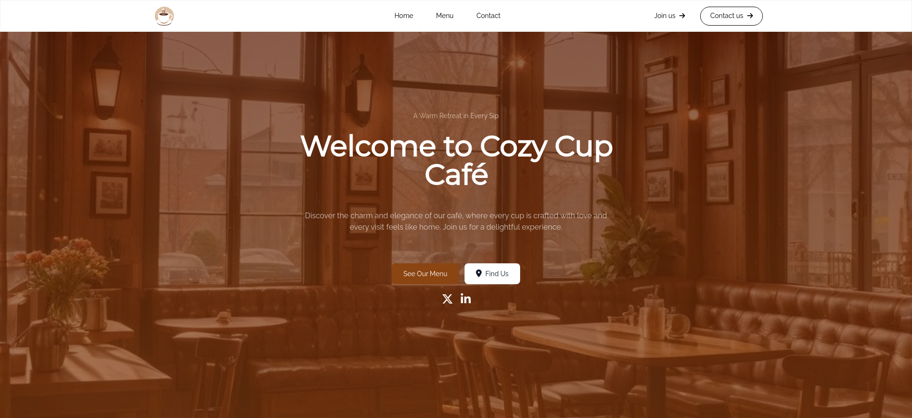
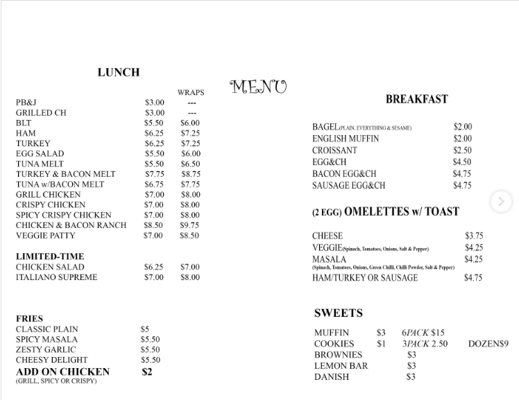
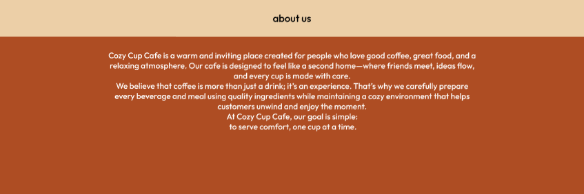
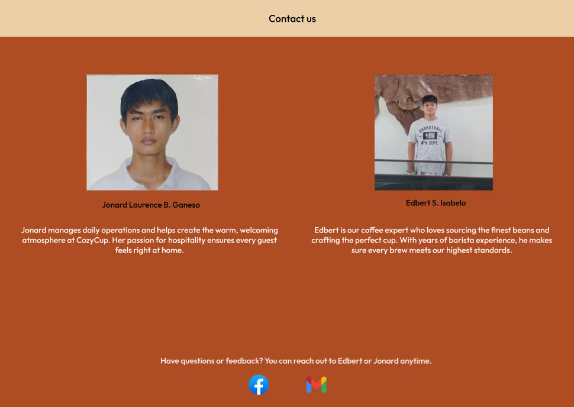

# ☕ Cozy Cup Cafe

## Project Description
Cozy Cup Cafe is a simple and welcoming cafe website designed to showcase the cafe’s menu, ambiance, and services. The project focuses on a clean layout, warm visuals, and an easy-to-navigate user experience that reflects the cozy atmosphere of the cafe.

## Features
- Responsive and modern cafe website design  
- Home page with cozy branding and introduction  
- Menu section displaying food and beverages  
- Contact information and location details  
- User-friendly layout suitable for desktop and mobile devices  

## Screen Captures  

This image displays the website header and the main landing page of Cozy Cup Cafe.

This image showcases the cafe’s menu, highlighting the available food and beverage selections.

This image presents the story behind the business and introduces the owners of Cozy Cup Cafe.

This image displays the contact details and background design of Cozy Cup Cafe.

## About the Authors

**ISABELO & GANESO**

**Name:** EDBERT ISABELO & JONARD LAURENCE GANESO  
**Email:** edbertisabelo28@gmail.com  

## Social Media Links

